## **DOCUMENTATION OF PROJECT 1**

### STEP 0: Preparing prerequisites

- [AWS account setup and Provisioning an Ubuntu Server](https://www.youtube.com/watch?v=xxKuB9kJoYM&list=PLtPuNR8I4TvkwU7Zu0l0G_uwtSUXLckvh&index=7)
- [Connecting to your EC2 Instance](https://www.youtube.com/watch?v=TxT6PNJts-s&list=PLtPuNR8I4TvkwU7Zu0l0G_uwtSUXLckvh&index=8)

### Procedure

- Register a new AWS account following this instruction.
- Select your preferred region (the closest to you) and launch a new EC2 instance of t2.micro family with Ubuntu Server 20.04 LTS (HVM)

  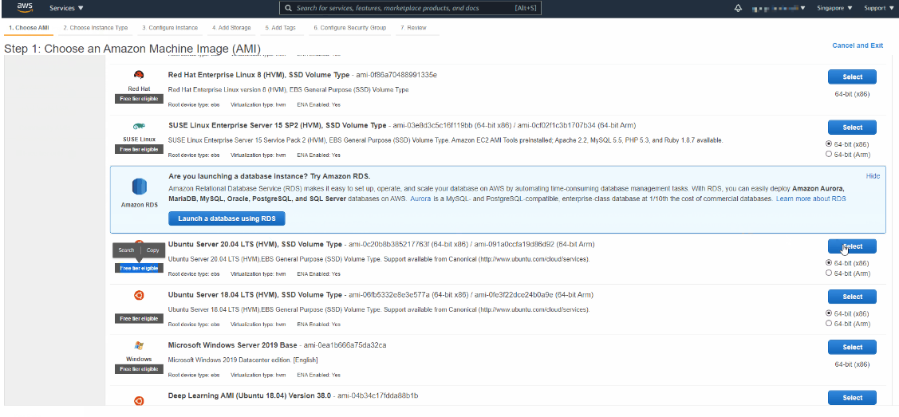

### Connecting to EC2 Terminal

- we are going to use that PEM key to connect to our EC2 Instnace via ssh.

  `cd Downloads`

- Connect to the instance by running

  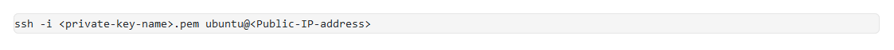

You can launch and stop new instances when you need to. In this first projects we will be using only 1 running instance at a time. When you stop an instance – it stops consuming available hours.

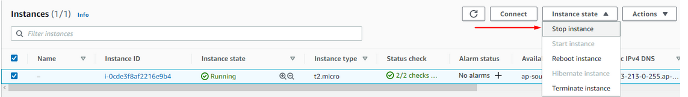

### STEP 1: Installing Apache ans Updating the Firewall

`sudo apt update`

`sudo apt install apache2`

`sudo systemctl status apache2`

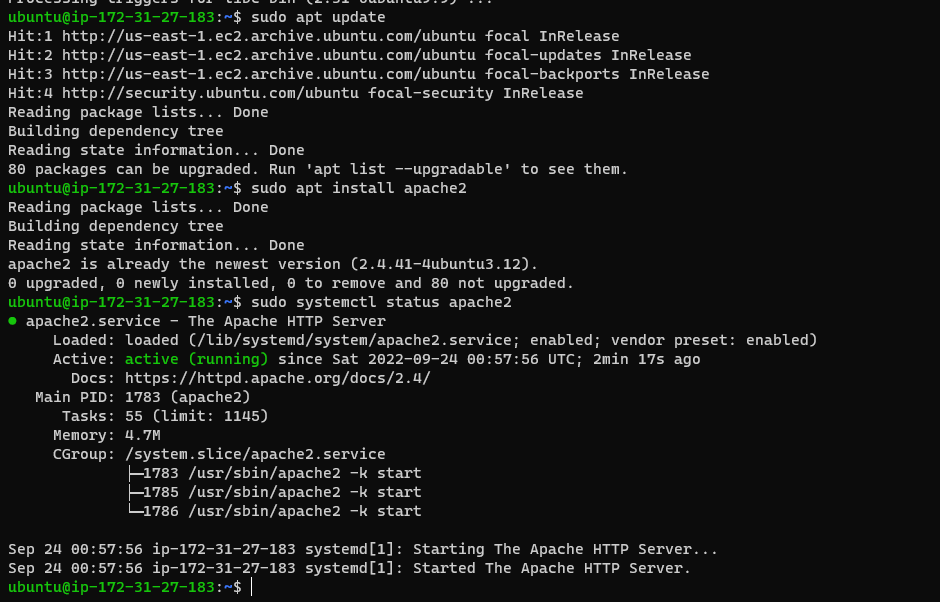

To test how our Apache HTTP server can respond to requests from the Internet, click the connect option , then copy and paste the ssh link to the browser

Result-
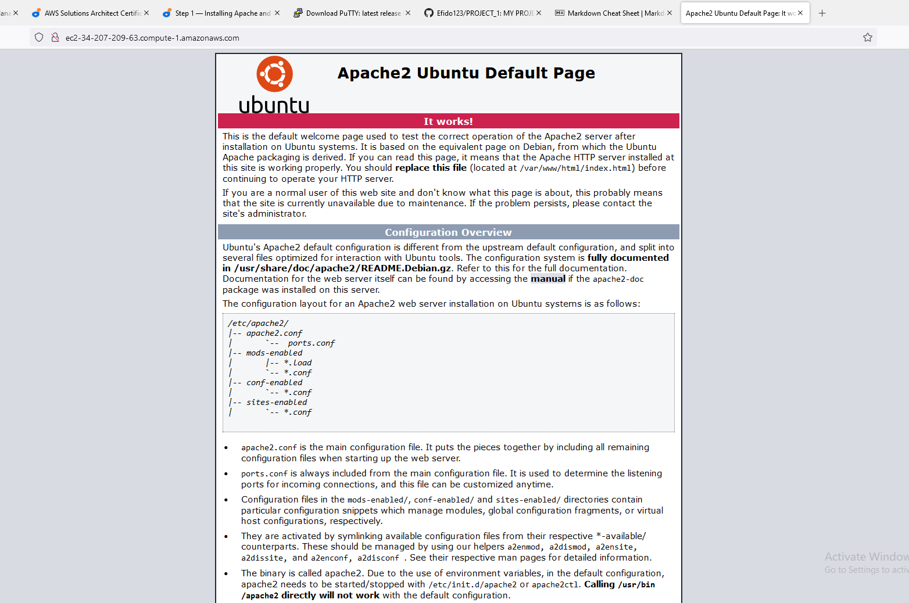

### STEP 2: Installing MSQL

` sudo apt install mysql-server`

`sudo mysql_secure_installation`

`sudo mysql -p`

`mysql> exit`

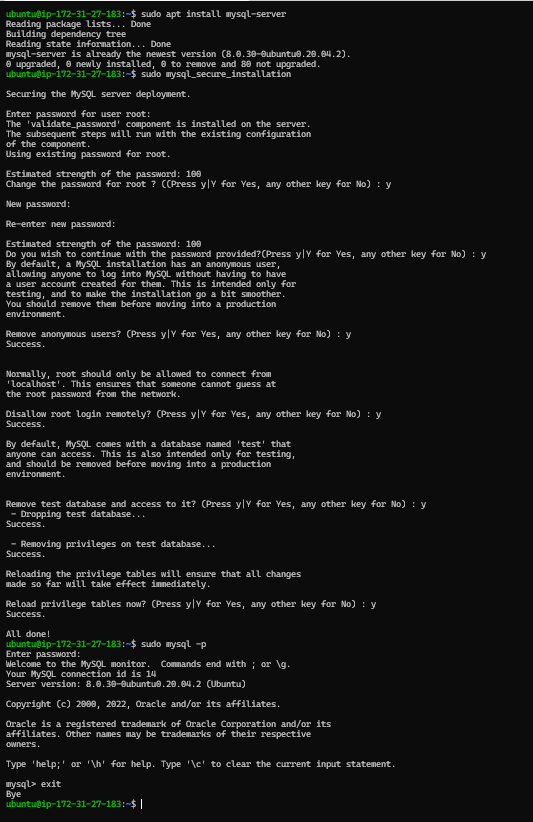

### STEP 3: Installing PHP

Input

`sudo apt install php libapache2-mod-php php-mysql`

`php -v`

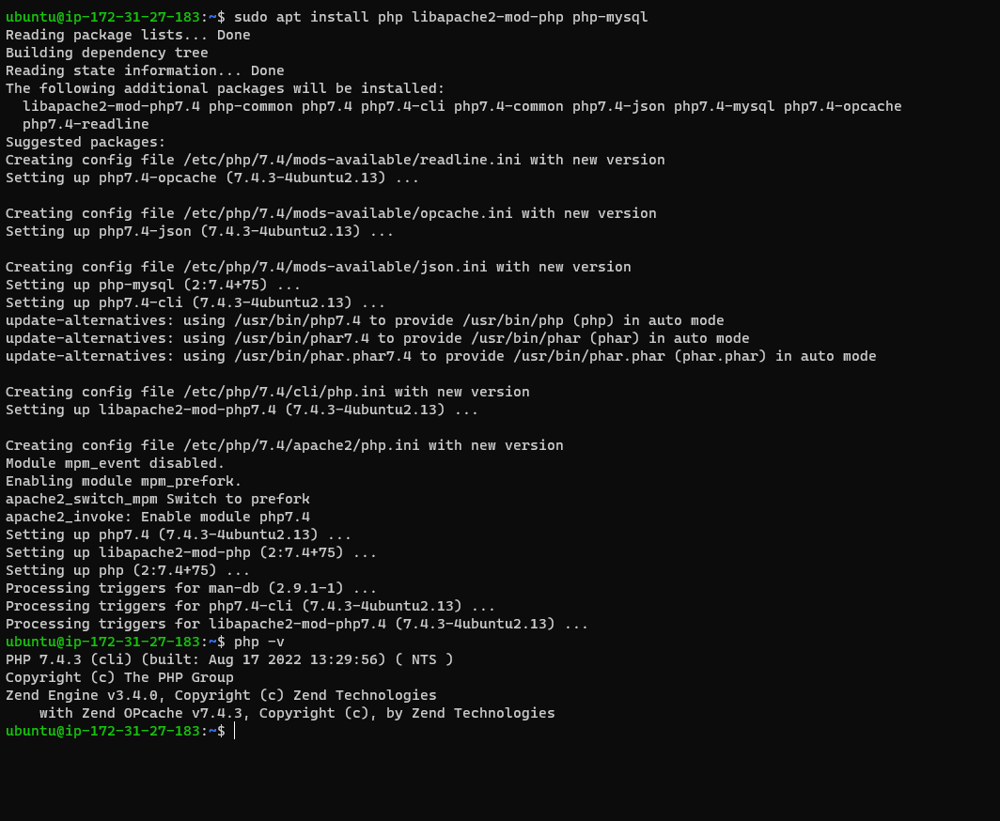

LAMP stack is completely installed and fully operational.

- Linux (Ubuntu)
- Apache HTTP Server
- MySQL
- PHP

### STEP 4: Creating a Virtual Host for a Website using Apache

**input**

`sudo mkdir /var/www/projectlamp`

` sudo chown -R $USER:$USER /var/www/projectlamp`

**create and open a new configuration file in Apache’s sites-available directory using vim command-line editor and input the codes below.**

`sudo vi /etc/apache2/sites-available/projectlamp.conf`

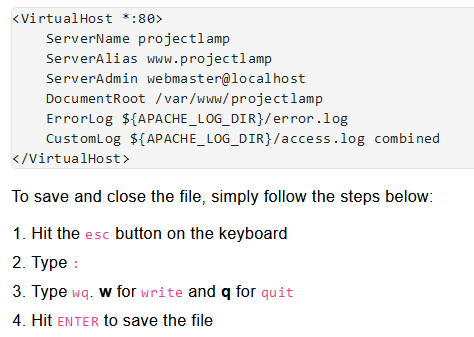

**using the ls command to show the new file in the sites-available directory.**

`sudo ls /etc/apache2/sites-available`

`000-default.conf default-ssl.conf projectlamp.conf`

**using a2ensite command to enable the new virtual host:**

`sudo a2ensite projectlamp `

`sudo a2dissite 000-default `

`sudo apache2ctl configtest `

**Finally, reload Apache so these changes take effect:**

`sudo systemctl reload apache2 `

**The new website is now active, but the web root /var/www/projectlamp is still empty. Create an index.html file in that location so that we can test that the virtual host works as expected:**

`sudo echo 'Hello LAMP from hostname' $(curl -s http://169.254.169.254/latest/meta-data/public-hostname) 'with public IP' $(curl -s http://169.254.169.254/latest/meta-data/public-ipv4) > /var/www/projectlamp/index.html `

**Use the browser and try to open your website URL using IP address in the form :**

`http://<Public-IP-Address>:80 `

**Result:**

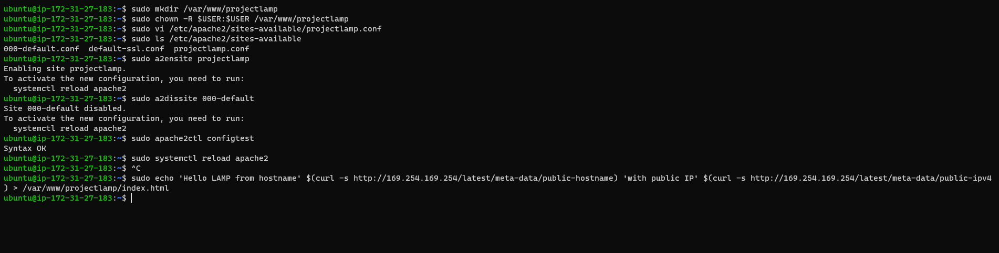

### STEP 6: Enable PHP on the Website

`sudo vim /etc/apache2/mods-enabled/dir.conf`

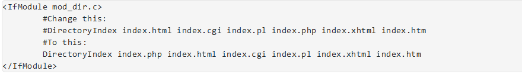

**After saving and closing the file, you will need to reload Apache so the changes take effect:**

`sudo systemctl reload apache2`

`vim /var/www/projectlamp/index.php`

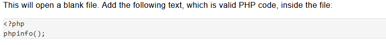

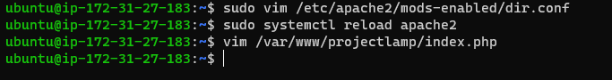

**When you are finished, save and close the file**

**result**

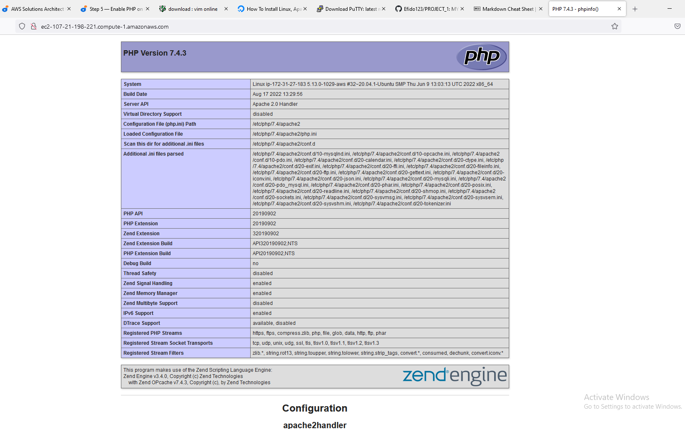

It’s best to remove the file you created as it contains sensitive information about your PHP environment -and your Ubuntu server. You can use rm to do so:

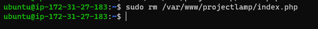
